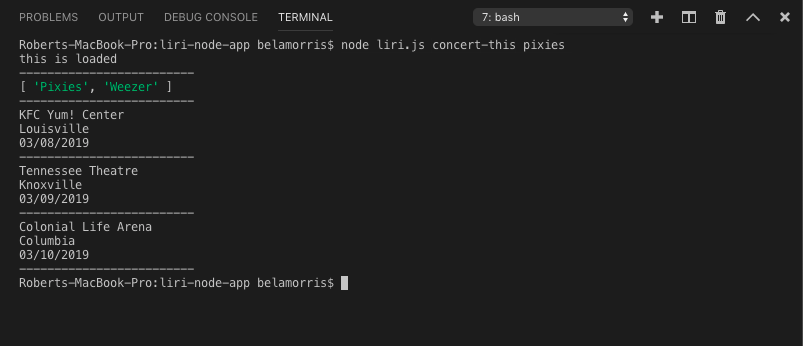

# liri-node-app
LIRI Bot
LIRI is like iPhone's SIRI, however, while SIRI is a Speech Interpretation and Recognition Interface, LIRI is a Language Interpretation and Recognition Interface. LIRI is be a command line node app that takes in on of four parameters and returns the relative data.
concert-this spotify-this-song movie-this do-what-it-says

Deployment
Clone repo
Run npm install
At command prompt run node liri.js <pass in an instruction from above>

Screenshot of the concert-this command

Screenshot of the movie-this

Screenshot of spotify-this-song

Screenshot of do-what-it-says

Technologies Utilized
NodeJS
JavaScript
Spotify API
bandsintown API
OMDB API
NPM simple-node-logger
NPM spotify-web-api-node
NPM dotenv
NPM moment

Author
Robert Morris

